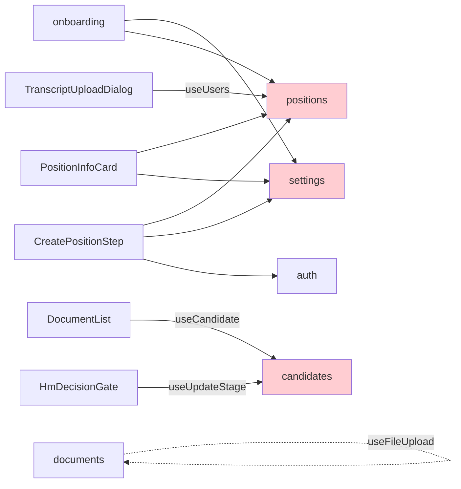

# Frontend Components Diagram

## Architecture Overview

```
src/
├── routes/          → Pages (TanStack Router)
├── widgets/         → Composite UI components (domain-specific)
├── features/        → Domain hooks (data fetching / mutations)
├── shared/
│   ├── ui/          → Primitive UI components (shadcn/ui)
│   ├── lib/         → Utility functions
│   └── api/         → Auto-generated API client (do not edit)
```

## Full Dependency Graph

```mermaid
graph TD
    subgraph Routes["Routes (Pages)"]
        R_ROOT["__root.tsx"]
        R_AUTH["_authenticated.tsx"]
        R_LOGIN["login.tsx"]
        R_CALLBACK["auth/callback.tsx"]
        R_DASH["dashboard.tsx"]
        R_INDEX["index.tsx (redirect)"]
        R_CAND_LIST["candidates/index.tsx"]
        R_CAND_DETAIL["candidates/$candidateId.tsx"]
        R_POS_LIST["positions/index.tsx"]
        R_POS_DETAIL["positions/$positionId.tsx"]
        R_SETTINGS["settings.tsx"]
        R_CATCH["$.tsx (404)"]
    end

    subgraph Widgets_Candidates["widgets/candidates"]
        W_ADD_POS["AddToPositionDialog"]
        W_CAND_INFO["CandidateInfoCard"]
        W_CAND_POS_TBL["CandidatePositionsTable"]
    end

    subgraph Widgets_Dashboard["widgets/dashboard"]
        W_PIPELINE["CandidatesPipeline"]
        W_POS_OVER["PositionsOverview"]
        W_RECENT["RecentActivity"]
    end

    subgraph Widgets_Documents["widgets/documents"]
        W_CV_UPLOAD["CvUploadDialog"]
        W_CV_HISTORY["CvVersionHistory"]
        W_DOC_RENDER["DocumentContentRenderer"]
        W_DOC_LIST["DocumentList"]
        W_DOC_VIEW["DocumentViewer"]
        W_GLOBAL_UP["GlobalUploadMenu"]
        W_INLINE_TX["InlineTranscriptViewer"]
        W_TX_UPLOAD["TranscriptUploadDialog"]
        W_UP_STATUS["UploadStatusDisplay"]
        W_UP_ZONE["UploadZone"]
    end

    subgraph Widgets_Evaluations["widgets/evaluations"]
        W_CV_RESULT["CvAnalysisResult"]
        W_EVAL_HIST["EvaluationHistoryDialog"]
        W_EVAL_PRIM["EvaluationPrimitives"]
        W_EVAL_RES["EvaluationResults"]
        W_EVAL_STEP["EvaluationStepCard"]
        W_EVAL_BANNER["EvaluationSummaryBanner"]
        W_FEEDBACK["FeedbackDraftResult"]
        W_HM_GATE["HmDecisionGate"]
        W_RECOMMEND["RecommendationResult"]
        W_RESULT_REND["ResultRenderer"]
        W_SCREENING["ScreeningEvalResult"]
        W_TECH_EVAL["TechnicalEvalResult"]
    end

    subgraph Widgets_Onboarding["widgets/onboarding"]
        W_OB_WIZARD["OnboardingWizard"]
        W_OB_POS["CreatePositionStep"]
        W_OB_TEAM["CreateTeamStep"]
        W_OB_HOW["HowItWorksStep"]
        W_OB_READY["ReadyStep"]
        W_OB_WELCOME["WelcomeStep"]
    end

    subgraph Widgets_Positions["widgets/positions"]
        W_POS_CAND_TBL["PositionCandidatesTable"]
        W_POS_INFO["PositionInfoCard"]
    end

    subgraph Widgets_Rubrics["widgets/rubrics"]
        W_ASSIGN_RUB["AssignRubricDialog"]
        W_RUB_EDIT["RubricEditor"]
        W_RUB_SUMM["RubricSummaryCard"]
        W_RUB_TBL["RubricTemplateTable"]
        W_SAVE_TMPL["SaveAsTemplateDialog"]
        W_TMPL_EDIT["TemplateEditorDialog"]
        W_VER_HIST["VersionHistoryDialog"]
    end

    subgraph Widgets_Other["widgets/other"]
        W_SIDEBAR["Sidebar"]
        W_USER_MENU["UserMenu"]
    end

    subgraph Features["features/ (domain hooks)"]
        F_AUTH["auth"]
        F_CAND["candidates"]
        F_DASH["dashboard"]
        F_DOC["documents"]
        F_EVAL["evaluations"]
        F_OB["onboarding"]
        F_POS["positions"]
        F_RUB["rubrics"]
        F_SET["settings"]
    end

    subgraph Shared_UI["shared/ui (primitives)"]
        UI_BTN["Button ⭐"]
        UI_BADGE["Badge ⭐"]
        UI_CARD["Card ⭐"]
        UI_INPUT["Input ⭐"]
        UI_SKEL["Skeleton ⭐"]
        UI_LABEL["Label"]
        UI_TABS["Tabs"]
        UI_PROG["Progress"]
        UI_SEP["Separator"]
        UI_ALERT["Alert"]
        UI_DIALOG["Dialog"]
        UI_ALERT_DLG["AlertDialog"]
        UI_TEXTAREA["Textarea"]
        UI_SELECT["Select"]
        UI_AVATAR["Avatar"]
        UI_DROP["DropdownMenu"]
        UI_TABLE["Table"]
        UI_FORM["Form"]
        UI_COLLAP["Collapsible"]
        UI_TOOLTIP["Tooltip"]
        UI_SONNER["Toaster"]
        UI_PAGIN["Pagination"]
    end

    subgraph Shared_Lib["shared/lib (utils)"]
        LIB_UTILS["utils (cn)"]
        LIB_STAGE["stage-utils ⭐"]
        LIB_FORMAT["format ⭐"]
        LIB_CONTENT["content-type"]
        LIB_EVAL_SUM["evaluation-summary"]
        LIB_EVAL_UTL["evaluation-utils"]
        LIB_FILE["file-types"]
    end

    %% Route → Widget dependencies
    R_ROOT --> W_USER_MENU
    R_ROOT --> UI_SONNER
    R_AUTH --> W_SIDEBAR
    R_AUTH --> W_OB_WIZARD
    R_CAND_DETAIL --> W_CV_UPLOAD
    R_CAND_DETAIL --> W_TX_UPLOAD
    R_CAND_DETAIL --> W_DOC_LIST
    R_CAND_DETAIL --> W_DOC_VIEW
    R_CAND_DETAIL --> W_CV_HISTORY
    R_CAND_DETAIL --> W_CAND_POS_TBL
    R_CAND_DETAIL --> W_ADD_POS
    R_CAND_DETAIL --> W_CAND_INFO
    R_CAND_DETAIL --> W_EVAL_RES
    R_CAND_DETAIL --> W_EVAL_BANNER
    R_POS_DETAIL --> W_RUB_SUMM
    R_SETTINGS --> W_RUB_TBL
    R_SETTINGS --> W_TMPL_EDIT

    %% Route → Feature dependencies
    R_ROOT --> F_AUTH
    R_AUTH --> F_AUTH
    R_AUTH --> F_OB
    R_LOGIN --> F_AUTH
    R_CALLBACK --> F_AUTH
    R_CAND_LIST --> F_CAND
    R_CAND_LIST --> F_POS
    R_CAND_DETAIL --> F_CAND
    R_CAND_DETAIL --> F_POS
    R_CAND_DETAIL --> F_DOC
    R_CAND_DETAIL --> F_EVAL
    R_POS_LIST --> F_POS
    R_POS_LIST --> F_SET
    R_POS_DETAIL --> F_POS
    R_SETTINGS --> F_SET

    %% Widget → Feature dependencies
    W_ADD_POS --> F_CAND
    W_CAND_INFO --> F_CAND
    W_CAND_POS_TBL --> F_CAND
    W_PIPELINE --> F_DASH
    W_POS_OVER --> F_DASH
    W_RECENT --> F_DASH
    W_CV_UPLOAD --> F_DOC
    W_CV_HISTORY --> F_DOC
    W_DOC_LIST --> F_DOC
    W_DOC_LIST --> F_CAND
    W_DOC_VIEW --> F_DOC
    W_INLINE_TX --> F_DOC
    W_TX_UPLOAD --> F_DOC
    W_TX_UPLOAD --> F_POS
    W_GLOBAL_UP --> F_CAND
    W_EVAL_HIST --> F_EVAL
    W_EVAL_RES --> F_EVAL
    W_EVAL_STEP --> F_EVAL
    W_HM_GATE --> F_CAND
    W_OB_POS --> F_POS
    W_OB_POS --> F_SET
    W_OB_POS --> F_AUTH
    W_OB_TEAM --> F_SET
    W_POS_INFO --> F_POS
    W_POS_INFO --> F_SET
    W_ASSIGN_RUB --> F_RUB
    W_SAVE_TMPL --> F_RUB
    W_TMPL_EDIT --> F_RUB
    W_SIDEBAR --> F_OB
    W_USER_MENU --> F_AUTH

    %% Feature cross-dependencies
    F_OB --> F_SET
    F_OB --> F_POS

    %% Widget → Widget dependencies
    W_CV_UPLOAD --> W_UP_ZONE
    W_TX_UPLOAD --> W_UP_ZONE
    W_GLOBAL_UP --> W_CV_UPLOAD
    W_GLOBAL_UP --> W_TX_UPLOAD
    W_SIDEBAR --> W_GLOBAL_UP

    %% Heavily used shared/ui (⭐ = used by 5+ consumers)
    W_ADD_POS --> UI_BTN
    W_CAND_INFO --> UI_CARD
    W_CAND_INFO --> UI_INPUT
    W_CAND_INFO --> UI_BTN
    W_CAND_POS_TBL --> UI_BTN
    W_CAND_POS_TBL --> UI_BADGE

    %% Shared lib usage
    W_CAND_POS_TBL --> LIB_STAGE
    W_CAND_INFO --> LIB_FORMAT
    W_DOC_LIST --> LIB_FORMAT
    W_CV_UPLOAD --> LIB_CONTENT
    W_UP_ZONE --> LIB_CONTENT
    W_EVAL_RES --> LIB_EVAL_SUM
    W_EVAL_STEP --> LIB_EVAL_SUM

    style Routes fill:#e1f5fe
    style Features fill:#fff3e0
    style Shared_UI fill:#e8f5e9
    style Shared_Lib fill:#f3e5f5
    style Widgets_Candidates fill:#fce4ec
    style Widgets_Dashboard fill:#fce4ec
    style Widgets_Documents fill:#fce4ec
    style Widgets_Evaluations fill:#fce4ec
    style Widgets_Onboarding fill:#fce4ec
    style Widgets_Positions fill:#fce4ec
    style Widgets_Rubrics fill:#fce4ec
    style Widgets_Other fill:#fce4ec
```



## Shared UI Usage Heatmap

| Component | Consumers | Used By |
|-----------|-----------|---------|
| **Button** | **22** | Nearly every widget + routes + AlertDialog + Dialog |
| **Badge** | **10** | CandidatePositionsTable, CvAnalysisResult, CvVersionHistory, EvalHistoryDialog, EvalStepCard, EvalSummaryBanner, PositionCandidatesTable, PositionsOverview, RecentActivity, RecommendationResult, VersionHistoryDialog, route pages |
| **Skeleton** | **8** | CandidatesPipeline, DocumentContentRenderer, EvalHistoryDialog, EvalResults, InlineTranscriptViewer, PositionsOverview, RecentActivity, route pages |
| **Card** | **7** | CandidateInfoCard, EvalStepCard, PositionCandidatesTable, PositionInfoCard, RubricSummaryCard, route pages |
| **Input** | **7** | CandidateInfoCard, GlobalUploadMenu, PositionInfoCard, RubricEditor, SaveAsTemplateDialog, TemplateEditorDialog, route pages |
| **Label** | **5** | GlobalUploadMenu, PositionInfoCard, RubricEditor, SaveAsTemplateDialog, TemplateEditorDialog, route/settings |
| **Progress** | **4** | UploadZone, UploadStatusDisplay, EvalSummaryBanner, TechnicalEvalResult, OnboardingWizard |
| **Tabs** | **2** | DocumentList, InlineTranscriptViewer |
| **Alert** | **2** | RecommendationResult, route/login, route/settings |
| **Separator** | **2** | Sidebar, route/settings |
| **Textarea** | **2** | TranscriptUploadDialog, route/positions |
| Avatar | 1 | UserMenu |
| DropdownMenu | 0 | _unused_ |
| Table | 0 | _unused_ |
| Form | 0 | _unused_ |
| Collapsible | 0 | _unused_ |
| Tooltip | 0 | _unused_ |
| Pagination | 0 | _unused_ |
| Select | 0 | _unused_ |

## Shared Lib Usage

| Module | Consumers | Notes |
|--------|-----------|-------|
| **utils (cn)** | 17+ | All shared/ui + several widgets — foundational |
| **stage-utils** | 8 | CandidatePositionsTable, PositionCandidatesTable, PositionsOverview, RecentActivity, CandidatesPipeline, route pages |
| **format** | 5 | CandidateInfoCard, DocumentList, CvVersionHistory, InlineTranscriptViewer, PositionInfoCard |
| **evaluation-summary** | 2 | EvaluationResults, EvaluationStepCard |
| **evaluation-utils** | 2 | useEvaluationStream, useRerunEvaluation |
| **content-type** | 3 | CvUploadDialog, TranscriptUploadDialog, UploadZone, useFileUpload |
| **file-types** | 2 | UploadZone, useFileUpload |

## Feature Cross-Dependencies



## Analysis & Recommendations

### 1. UNUSED shared/ui components — candidates for removal

These shadcn/ui components are installed but **never imported** anywhere:

| Component | Action |
|-----------|--------|
| `DropdownMenu` | Remove or use in UserMenu/context menus |
| `Table` | Remove — custom tables used instead |
| `Form` | Remove — react-hook-form used directly |
| `Collapsible` | Remove unless planned |
| `Tooltip` | Remove unless planned |
| `Pagination` | Remove unless planned |
| `Select` | Remove — native selects or custom dropdowns used instead |

### 2. Patterns that should be EXTRACTED to shared widgets

#### a) **Dialog pattern** (repeated across 6+ widgets)
`CvUploadDialog`, `TranscriptUploadDialog`, `AddToPositionDialog`, `AssignRubricDialog`, `SaveAsTemplateDialog`, `TemplateEditorDialog`, `EvaluationHistoryDialog`, `VersionHistoryDialog` — all use a similar open/close + form + submit pattern.

**Recommendation:** Create `shared/ui/form-dialog.tsx` — a composable dialog wrapper that handles open state, title, description, submit/cancel buttons, and loading state. Widgets would only provide the form body.

#### b) **Info card with edit mode** (repeated in 2 widgets)
`CandidateInfoCard` and `PositionInfoCard` both implement: display mode → edit mode toggle → form with save/cancel → mutation call.

**Recommendation:** Extract `shared/ui/editable-card.tsx` or a `useEditableCard` hook to shared.

#### c) **Upload orchestration** (tightly coupled)
`CvUploadDialog` → `UploadZone`, `TranscriptUploadDialog` → `UploadZone`, `GlobalUploadMenu` → both dialogs. The upload flow (`presign → upload → complete`) is in `useFileUpload` but UI pieces (`UploadZone`, `UploadStatusDisplay`) live in `widgets/documents/`.

**Recommendation:** Move `UploadZone` and `UploadStatusDisplay` to `shared/ui/` — they are generic upload primitives with no domain logic.

### 3. Cross-domain hook usage — potential shared layer

| Hook | Defined In | Used Outside Domain By |
|------|-----------|----------------------|
| `useUsers` | `features/positions` | `TranscriptUploadDialog`, `PositionInfoCard`, `CreatePositionStep` |
| `useTeams` | `features/settings` | `PositionInfoCard`, `CreatePositionStep`, `positions/index` route |
| `useCandidate` | `features/candidates` | `DocumentList` (widget/documents) |
| `useUpdateStage` | `features/candidates` | `HmDecisionGate` (widget/evaluations) |

**Recommendation:**
- `useUsers` is not candidate/position-specific — move to `features/users/` or `features/shared/`
- `useTeams` is referenced by 3 domains (settings, positions, onboarding) — consider `features/teams/` as standalone

### 4. Heavy route pages — decomposition candidates

**`candidates/$candidateId.tsx`** imports from **5 feature domains** and **8 widgets**. This is the most complex page.

**Recommendation:** Break into sub-widgets:
- `CandidateDocumentsPanel` (wraps DocumentList + upload dialogs + viewer)
- `CandidateEvaluationsPanel` (wraps EvaluationResults + EvaluationSummaryBanner)

This would reduce the route file to composing 3-4 panels instead of 10+ widgets.

### 5. Evaluation widgets — internal decomposition

`widgets/evaluations/` has **12 files** — the largest widget group. Several are leaf renderers (`CvAnalysisResult`, `ScreeningEvalResult`, `TechnicalEvalResult`, `FeedbackDraftResult`, `RecommendationResult`) that are only used by `ResultRenderer`.

**Recommendation:** These are fine as-is (strategy pattern), but `EvaluationPrimitives` should move to `shared/ui/` since it provides generic display atoms (`ScoreBar`, `Section`, etc.) with no domain logic.

### Summary Priority Matrix

| Priority | Action | Impact |
|----------|--------|--------|
| 🔴 High | Move `UploadZone`/`UploadStatusDisplay` → `shared/ui/` | Enables reuse, reduces widget coupling |
| 🔴 High | Extract `useUsers` → `features/users/` | Fixes misplaced cross-domain dependency |
| 🟡 Medium | Create `FormDialog` shared component | Reduces boilerplate in 6+ dialogs |
| 🟡 Medium | Decompose `candidates/$candidateId` route | Reduces page complexity from 13 imports |
| 🟡 Medium | Move `EvaluationPrimitives` → `shared/ui/` | Generic atoms don't belong in domain widgets |
| 🟢 Low | Remove unused shared/ui (7 components) | Reduces bundle, cleaner codebase |
| 🟢 Low | Extract `EditableCard` pattern | DRYs up 2 info cards |
